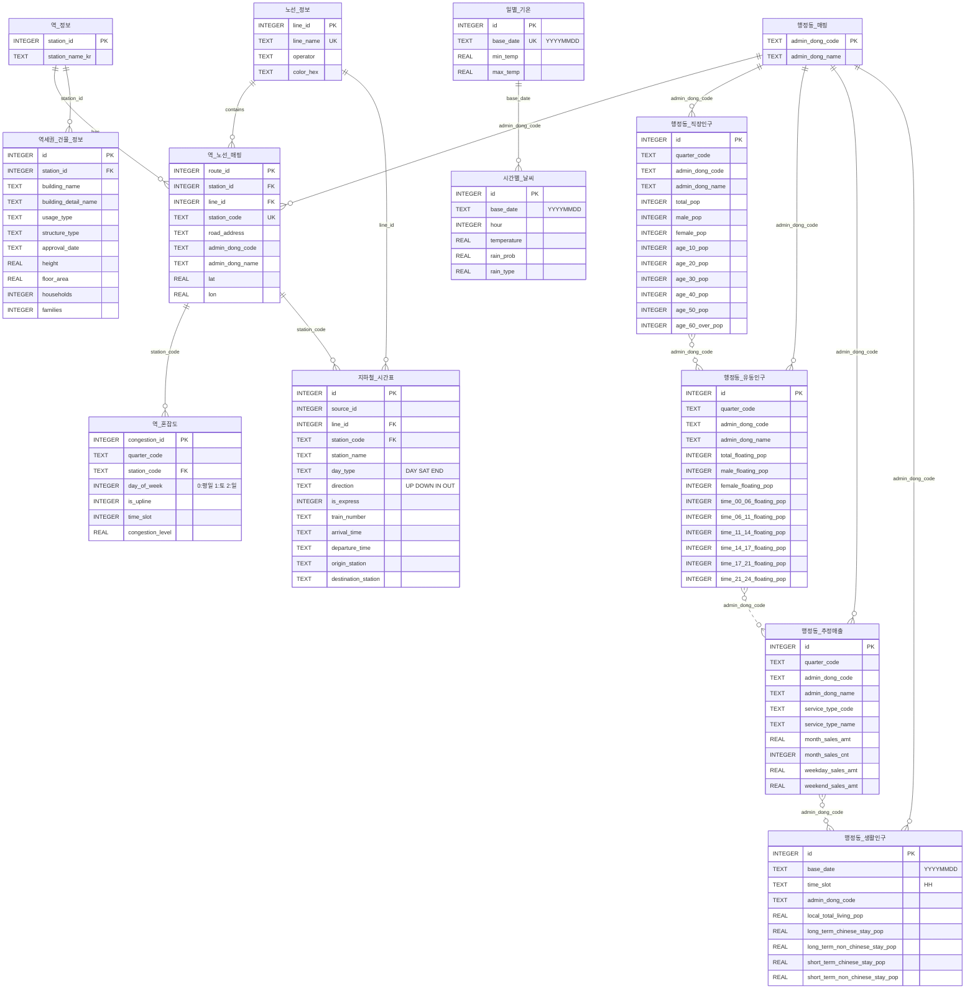

# Database ERD

## Main Database (schema.sql)



## Weather Database (weather_schema.sql)

```mermaid

```

## 관계 설명

### Main Database

| 관계 | 설명 |
|------|------|
| 역_정보 → 역_노선_매핑 | 하나의 역이 여러 노선에 존재 가능 (1:N) |
| 노선_정보 → 역_노선_매핑 | 하나의 노선에 여러 역 존재 (1:N) |
| 역_노선_매핑 → 역_혼잡도 | 노선별 역에 시간대/요일별 혼잡도 데이터 (1:N) |
| 역_정보 → 역세권_건물_정보 | 역별 역세권 건물 정보 (1:N) |
| 역_노선_매핑 → 지하철_시간표 | `station_code`로 역별 열차 시간표 연결 (1:N) |
| 노선_정보 → 지하철_시간표 | `line_id`로 호선별 열차 시간표 연결 (1:N) |
| 행정동_매핑 → 행정동_* | 행정동 코드 마스터 테이블 (1:N) |
| 행정동_매핑 → 역_노선_매핑 | 역의 행정동 정보 연결 (1:N) |

### Weather Database

| 관계 | 설명 |
|------|------|
| 일별_기온 → 시간별_날씨 | 일별 기온과 시간대별 기상정보 (1:N, `base_date` 기준) |

### Cross-Database 연결

| Main DB | Weather DB | 연결 키 |
|---------|------------|---------|
| 행정동_생활인구 | 일별_기온 | `base_date` |
| 행정동_생활인구 | 시간별_날씨 | `base_date` + `time_slot` |
| Impact_Analysis_OptionA | 일별_기온 | `base_date` |
