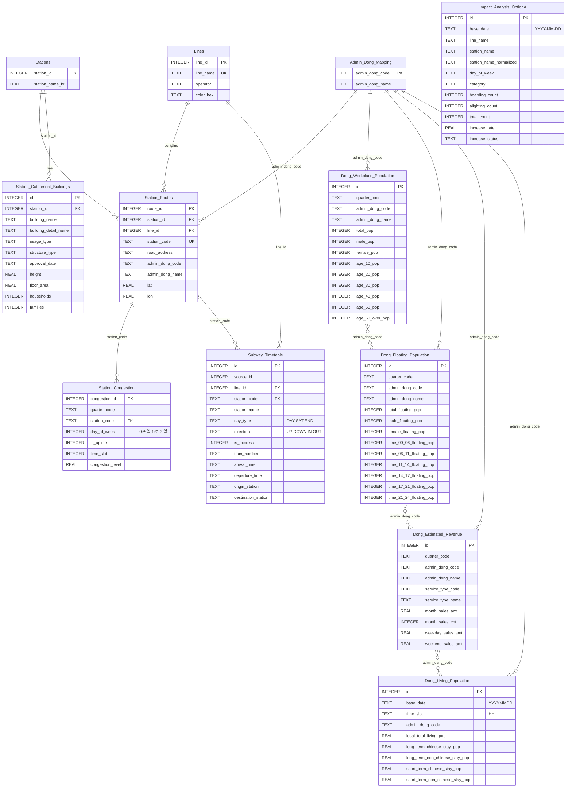

# Database ERD

## Main Database (schema.sql)

## Weather Database (weather_schema.sql)

## 관계 설명

### Main Database

| 관계 | 설명 |
|------|------|
| Stations → Station_Routes | 하나의 역이 여러 노선에 존재 가능 (1:N) |
| Lines → Station_Routes | 하나의 노선에 여러 역 존재 (1:N) |
| Station_Routes → Station_Congestion | 노선별 역에 시간대/요일별 혼잡도 데이터 (1:N) |
| Stations → Station_Catchment_Buildings | 역별 역세권 건물 정보 (1:N) |
| Station_Routes → Subway_Timetable | `station_code`로 역별 열차 시간표 연결 (1:N) |
| Lines → Subway_Timetable | `line_id`로 호선별 열차 시간표 연결 (1:N) |
| Admin_Dong_Mapping → Dong_* | 행정동 코드 마스터 테이블 (1:N) |
| Admin_Dong_Mapping → Station_Routes | 역의 행정동 정보 연결 (1:N) |

### Weather Database

| 관계 | 설명 |
|------|------|
| Daily_Temperature → Hourly_Weather | 일별 기온과 시간대별 기상정보 (1:N, `base_date` 기준) |

### Cross-Database 연결

| Main DB | Weather DB | 연결 키 |
|---------|------------|---------|
| Dong_Living_Population | Daily_Temperature | `base_date` |
| Dong_Living_Population | Hourly_Weather | `base_date` + `time_slot` |
| Impact_Analysis_OptionA | Daily_Temperature | `base_date` |
